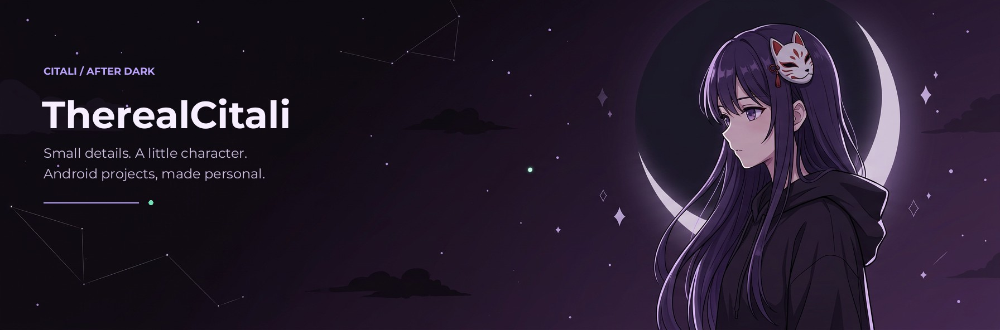

### ✦ Hey, I’m Citali.

**Android projects with personality.** 
A little open source. A little anime. A lot of making it feel right.

[Projects](#-on-the-workbench) · [Contributions](#-one-commit-at-a-time) · [Repositories](https://github.com/TherealCitali?tab=repositories)

## ☾ A little about this corner

- **Building for Android**, with a soft spot for thoughtful customization.
- **Currently focused on ShadowRPC** — bringing your phone’s activity to Discord.
- **Drawn to the details:** dark palettes, expressive themes, and interfaces that feel personal.
- **Keeping it open:** public code, visible progress, and proper credit to the projects underneath.

> The goal isn’t more noise on your screen. It’s something that feels like yours.

## ✦ On the workbench

<table>
<tr>
<td width="64%" valign="top">

###  ShadowRPC

**Your phone. Your presence.**

Discord Rich Presence for selected foreground apps on Android. Custom activity text, per-app overrides, privacy controls, and Material You / Manga / MIUI presets on current `main`.

Kotlin · Jetpack Compose · Discord OAuth2

[**Explore the project →**](https://github.com/TherealCitali/ShadowRPC) 
[Releases](https://github.com/TherealCitali/ShadowRPC/releases) · [Theme engines](https://github.com/TherealCitali/ShadowRPC/blob/main/docs/THEMES.md)

Features vary by release; newer presets are in prereleases after the original stable v1.0.0.

</td>
<td width="36%" valign="top">

### ↗ TaskPilot

**Another corner of the workbench.**

An AI-based Android automation project.

[**Browse the repository →**](https://github.com/TherealCitali/TaskPilot)

See the repository for its current state and setup.

</td>
</tr>
</table>

## 🐍 One commit at a time

*Leaving a little trail through the contribution grid.*

<picture>
  <source media="(prefers-color-scheme: dark)" srcset="https://raw.githubusercontent.com/TherealCitali/TherealCitali/output/snake-dark.svg">
  <source media="(prefers-color-scheme: light)" srcset="https://raw.githubusercontent.com/TherealCitali/TherealCitali/output/snake.svg">
  
</picture>

Generated from GitHub’s contribution calendar · scheduled daily · colors follow your GitHub theme

[Workflow](https://github.com/TherealCitali/TherealCitali/actions/workflows/contribution-snake.yml) · [View the SVG](https://raw.githubusercontent.com/TherealCitali/TherealCitali/output/snake-dark.svg)

## ✧ Say hello through the code

Found a bug, have a feature idea, or want to improve something? Open an issue in the relevant project. Clear reports and thoughtful suggestions are always a good place to start.

[**ShadowRPC issues**](https://github.com/TherealCitali/ShadowRPC/issues) · [**All repositories**](https://github.com/TherealCitali?tab=repositories)

<b>Behind the profile</b>

- Original AI-generated anime banner, composed for this profile; it does not depict a real person or an existing anime character.
- Profile typography rendered with [Montserrat](https://github.com/google/fonts/tree/main/ofl/montserrat), SIL Open Font License 1.1.
- ShadowRPC icon artwork by TherealCitali.
- Contribution animation by [Platane/snk](https://github.com/Platane/snk), deployed by [crazy-max/ghaction-github-pages](https://github.com/crazy-max/ghaction-github-pages).
- Badges by [Shields.io](https://shields.io/). The banner and divider are stored in this repository, not fetched from a wallpaper service.
- Automation uses GitHub’s built-in `GITHUB_TOKEN`. No personal access token is stored in the repository.
- GitHub may pause scheduled workflows in inactive public repositories; the workflow can also be run manually from Actions.

**Keep it personal. Keep building.** ☾

